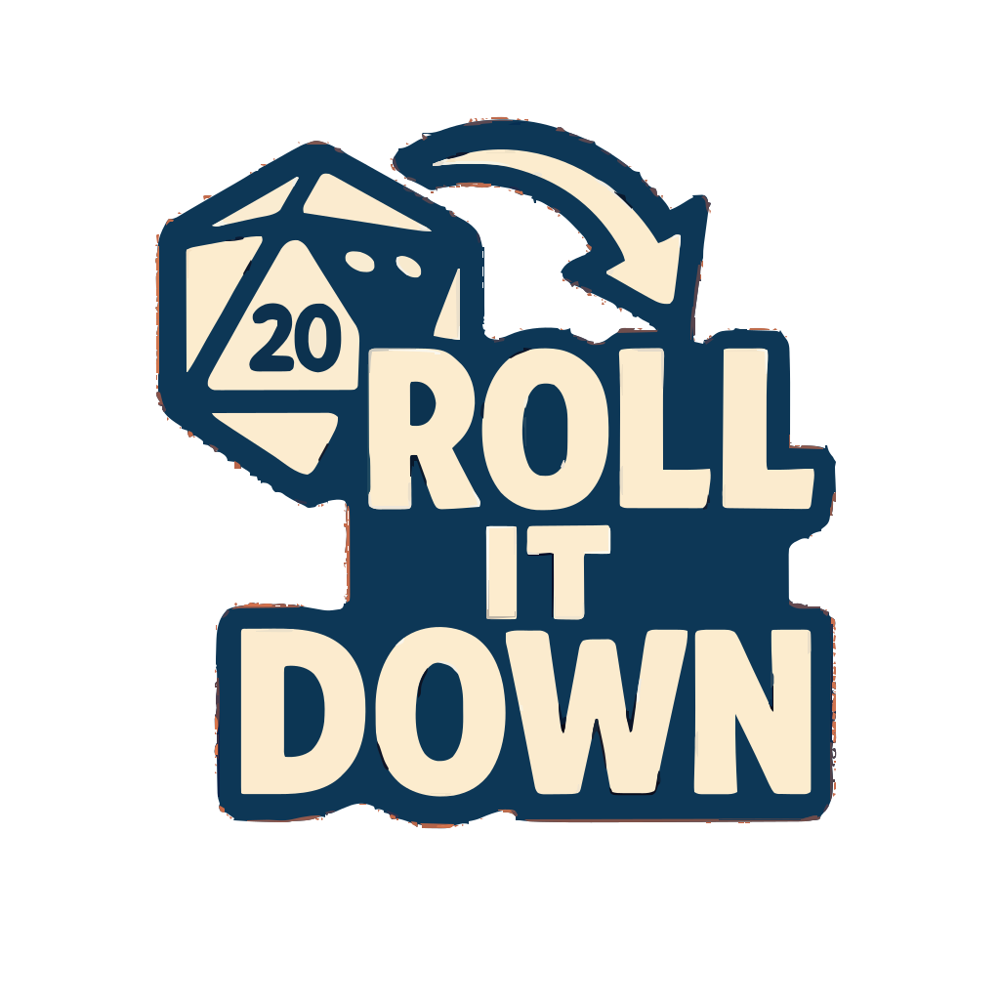

# 🎲 Roll It Down

<div align="center">
  
</div>

> De jogador para jogador. Feito pra quem vive cada sessão.

**Roll It Down** é um grimório digital com ferramentas épicas para mestres e jogadores de RPG de mesa. Pensado para acelerar sessões, organizar combates e ajudar a criar mundos incríveis com apenas alguns cliques.

---

## 🧙‍♂️ Visão Geral

A aplicação oferece uma **home interativa** com várias ferramentas (algumas em construção) e um **módulo funcional de gerenciamento de combate**, o **Oráculo do Combate**, onde é possível controlar iniciativas, HP, AC e muito mais.
Teste nosso site: [Roll It Down](https://roll-it-down.vercel.app/)
---

## 🚀 Funcionalidades

### Página Inicial (Landing Page)

- Carrossel com ferramentas disponíveis e em construção.
- Destaques visuais com **Framer Motion**, **React Slick** e **Ant Design**.
- Estilo temático inspirado em pergaminhos e tomos mágicos.

### Oráculo do Combate (`/tracker`)

- Tabela editável para controle de combate.
- Campos de:
  - Iniciativa (com botão de rolagem aleatória 🔮).
  - Nome do personagem.
  - Pontos de Vida (HP).
  - Classe de Armadura (AC).
- Controle de rodada:
  - Botão de próximo personagem.
  - Contador de rodada com animação de reinício.
  - Ordenação automática por iniciativa.
- Ações:
  - Adicionar nova linha.
  - Excluir personagem.
  - Limpar toda a tabela com confirmação.

---

## 🧱 Tecnologias Utilizadas

- **Next.js 13+** com App Router.
- **TypeScript**.
- **React + Ant Design**.
- **Framer Motion** (animações suaves).
- **React Slick** (carrossel de ferramentas).
- **CSS customizado** com Tailwind parcial.
- **React Icons** (ícones estilizados).
- Google Fonts: **Bebas Neue**, **Merriweather**, **Cinzel**.

---

## 📂 Estrutura de Pastas (parcial)

```bash
📦project-root
 ┣ 📁app
 ┃ ┣ 📁tracker
 ┃ ┃ ┣ 📜page.tsx (Oráculo do Combate)
 ┃ ┃ ┗ 📁components
 ┃ ┃   ┗ 📜EditableTable.tsx
 ┣ 📜page.tsx (Landing Page)
 ┣ 📜layout.tsx
 ┣ 📜globals.css
 ┣ 📜page.module.css (Landing Styles)
 ┣ 📜page.css (Tracker Styles)
 ┗ 📜EditableTable.css (Tabela personalizada)
```

---

## 🧪 Instalação e Execução

1. **Clone o repositório**

```bash
git clone https://github.com/seu-usuario/roll-it-down.git
cd roll-it-down
```

2. **Instale as dependências**

```bash
npm install
```

3. **Execute em modo de desenvolvimento**

```bash
npm run dev
```

4. Acesse em: `http://localhost:3000`

---

## 🔮 Roadmap Futuro

- [ ] Gerador de NPCs com traços únicos.
- [ ] Rolador de dados com efeitos visuais.
- [ ] Gerenciador de campanhas com histórico de sessões.
- [ ] Gerador visual de mapas com markers interativos.
- [ ] Randomizador de loot com raridades e categorias.

---

## 📜 Licença

MIT © [Roll It Down]

---

## 🙌 Contribuição

Pull Requests são bem-vindos! Caso tenha ideias para novas ferramentas ou melhorias, fique à vontade para contribuir.

---

> **Roll It Down** — porque a magia está nos detalhes da sua sessão.
